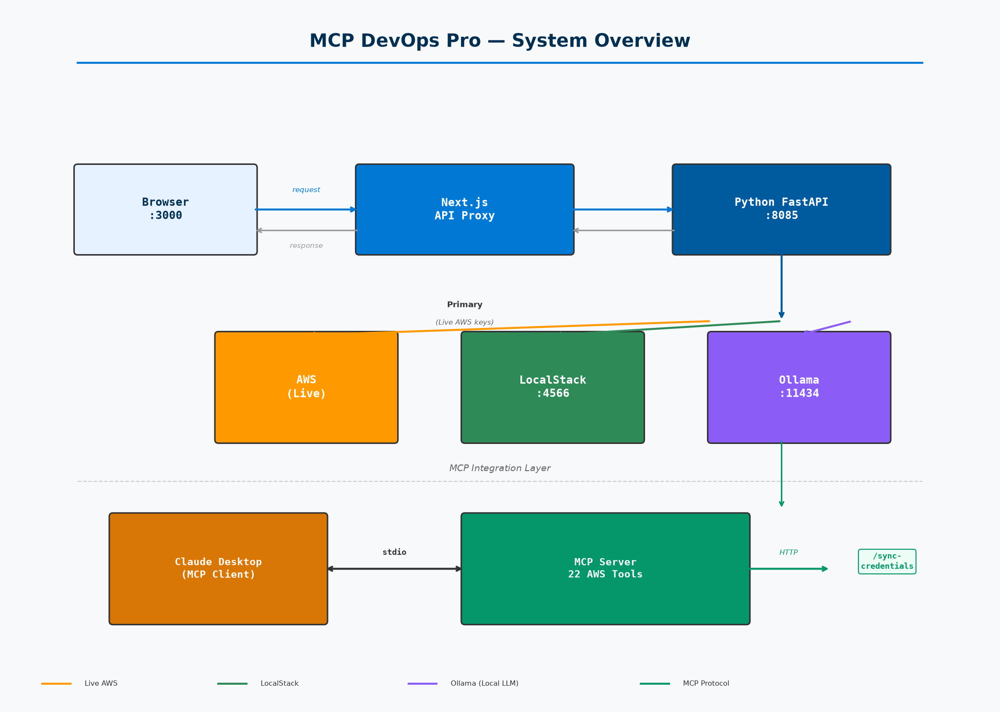
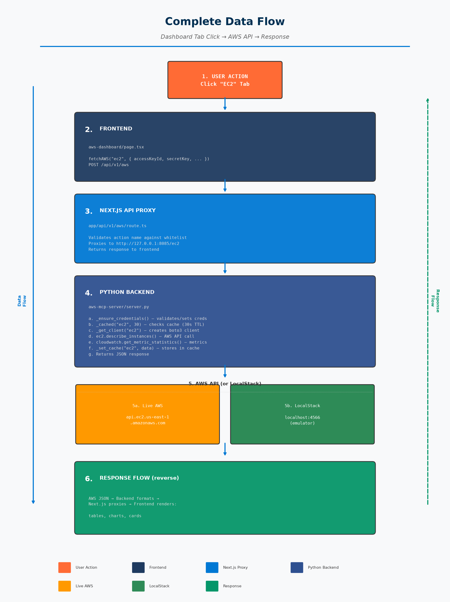

# MCP DevOps Pro

> AI-powered DevOps platform with real-time AWS monitoring, intelligent chatbot, security analysis, and Claude Desktop MCP integration.

[](https://nextjs.org/)
[](https://react.dev/)
[](https://python.org/)
[](https://fastapi.tiangolo.com/)
[](LICENSE)

---



---

## Features

| Feature | Description |
|---------|-------------|
| **AWS Dashboard** | Real-time monitoring of 30+ AWS services with charts and metrics |
| **AI Chatbot** | Natural language commands to query and manage AWS resources |
| **Security Analysis** | Automated security audit with scoring (0-100) |
| **Cost Optimization** | Cost analysis with savings recommendations |
| **Architecture Review** | Automated architecture health scoring |
| **LLM Integration** | Claude API + Ollama (local) + Groq (free) |
| **MCP Server** | 22 tools for Claude Desktop integration |
| **Dual Mode** | LocalStack (free) for testing, Real AWS for production |
| **Dark/Light Theme** | Route-based theming — dark on dashboard, light elsewhere |
| **Voice Chat** | Speech-to-text and text-to-speech in chatbot |
| **File Upload** | Drag-and-drop image/video/file attachments |

---

## How It Works



```
User clicks tab → Frontend fetchAWS() → Next.js proxy → Python backend
    → boto3 API call → AWS/LocalStack → Response → Tables/Charts/Cards
```

---

## Prerequisites

| Tool | Version | Check Command |
|------|---------|---------------|
| **Node.js** | 18+ | `node --version` |
| **npm** | 9+ | `npm --version` |
| **Python** | 3.10+ | `python3 --version` |
| **pip3** | Latest | `pip3 --version` |
| **Git** | Any | `git --version` |
| **Docker** | 20+ (for LocalStack) | `docker --version` |

### Install missing tools (Ubuntu/Debian):
```bash
sudo apt update
sudo apt install -y nodejs npm python3 python3-pip git docker.io
```

---

## Quick Start (3 Steps)

### Step 1: Clone the repository
```bash
git clone https://github.com/abdulJ04/MCP_Devops_pro.git
cd MCP_Devops_pro
```

### Step 2: Start everything
```bash
bash start.sh
```

This automatically:
- Installs npm dependencies (if missing)
- Installs Python dependencies (if missing)
- Starts Python backend on port **8085**
- Starts Next.js frontend on port **3000**

### Step 3: Open in browser
```
http://localhost:3000
```

**That's it!** You're ready to go.

---

## First-Time Setup Guide

### Option A: LocalStack (Free — No AWS Account Needed)

**Step 1: Start LocalStack**
```bash
# Start LocalStack in Docker
localstack start -d

# OR using Docker directly
docker run -d --name localstack-main -p 4566:4566 localstack/localstack
```

**Step 2: Create demo data (optional)**
```bash
cd localstack_test
bash setup-enterprise-demo.sh
```

**Step 3: Connect to dashboard**
1. Open `http://localhost:3000/aws-dashboard`
2. Toggle **"Use LocalStack"** to ON
3. Leave Access Key and Secret Key as `test`
4. Click **"Connect"**

**Step 4: Explore!**
- Click any tab (EC2, S3, Lambda, etc.)
- Try the chatbot: "list ec2 instances"
- Try "security analysis" or "health check"

---

### Option B: Real AWS Account

**Step 1: Get AWS credentials**
1. Go to [AWS Console](https://console.aws.amazon.com/) → IAM → Users → Your User
2. Click **Security Credentials** → **Create Access Key**
3. Copy the **Access Key ID** and **Secret Access Key**

**Step 2: Connect to dashboard**
1. Open `http://localhost:3000/aws-dashboard`
2. Toggle **"Use LocalStack"** to OFF
3. Enter your **Access Key ID** (starts with `AKIA`)
4. Enter your **Secret Access Key**
5. Select your **Region** (e.g., `us-east-1`)
6. Click **"Connect"**

**Step 3: Explore!**
- All 30+ AWS services will load automatically
- Try "cost analysis" for spending insights
- Try "architecture review" for infrastructure health

---

## AI Chatbot

The chatbot supports natural language commands with a 3-layer architecture:

### Layer 1: Direct Commands
```
"list ec2 instances"    → Shows all EC2 instances
"list s3 buckets"       → Shows all S3 buckets
"list lambda functions" → Shows all Lambda functions
"stop instance i-xxx"   → Stops an EC2 instance
"cost"                  → Shows cost overview
"security"              → Shows security findings
"help"                  → Shows all available commands
```

### Layer 2: AI Analysis
```
"security analysis"     → Deep security audit (score 0-100)
"cost analysis"         → Cost optimization recommendations
"architecture review"   → Architecture health check
"health check"          → Combined analysis of all three
```

### Layer 3: LLM Chat (for anything else)
```
"How to reduce my AWS bill?"
"What's the best instance type for my workload?"
"Explain my security findings"
```

**LLM Priority:**
1. Claude API (paid, best quality)
2. Ollama (free, local, ~6-11s response)
3. Local AI engine (instant, rule-based)

---

## API Reference

### Backend Endpoints (`http://localhost:8085`)

| Endpoint | Method | Description |
|----------|--------|-------------|
| `/auth` | POST | Authenticate with AWS or LocalStack |
| `/refresh` | POST | Clear cache for fresh data |
| `/disconnect` | POST | Clear credentials |
| `/set_timeout` | POST | Set session timeout |
| `/health` | GET | Health check |
| `/sync-credentials` | GET | MCP server credential sync |
| `/ec2` | POST | EC2 instances + CloudWatch metrics |
| `/s3` | POST | S3 buckets + encryption + object count |
| `/lambda` | POST | Lambda functions + invocation metrics |
| `/rds` | POST | RDS instances + connection metrics |
| `/iam` | POST | IAM users, roles, policies |
| `/vpc` | POST | VPCs, subnets, security groups |
| `/cost` | POST | Cost Explorer data (daily, by service, by region) |
| `/security` | POST | Cross-service security audit |
| `/activity` | POST | CloudTrail events (last 24h) |
| `/ebs` | POST | EBS volumes and snapshots |
| `/route53` | POST | Route 53 hosted zones |
| `/elb` | POST | Load balancers and target groups |
| `/auto_scaling` | POST | Auto Scaling groups |
| `/cloudwatch_dash` | POST | CloudWatch dashboards and alarms |
| `/ssm` | POST | SSM documents and parameters |
| `/ecr` | POST | ECR repositories |
| `/ecs` | POST | ECS clusters and services |
| `/eks` | POST | EKS clusters |
| `/cloudformation` | POST | CloudFormation stacks |
| `/codepipeline` | POST | CodePipeline pipelines |
| `/codebuild` | POST | CodeBuild projects |
| `/codedeploy` | POST | CodeDeploy applications |
| `/secrets_manager` | POST | Secrets Manager secrets |
| `/parameter_store` | POST | SSM Parameter Store |
| `/acm` | POST | ACM certificates |
| `/dynamodb` | POST | DynamoDB tables |
| `/sns` | POST | SNS topics and subscriptions |
| `/sqs` | POST | SQS queues |
| `/eventbridge` | POST | EventBridge rules |
| `/backup` | POST | AWS Backup vaults and plans |
| `/budgets` | POST | AWS Budgets |
| `/dashboard` | POST | Batch: all core services in parallel |
| `/chat` | POST | AI chatbot endpoint |

---

## Claude Desktop MCP Integration

Connect this platform to Claude Desktop for natural language AWS management.

### Setup

**Step 1: Configure Claude Desktop**

Edit `~/.config/Claude/claude_desktop_config.json`:

```json
{
  "mcpServers": {
    "aws-devops": {
      "command": "python3",
      "args": [
        "/home/YOUR_USERNAME/MCP_Devops_pro/claude-mcp-server.py"
      ],
      "env": {
        "MCP_BACKEND_URL": "http://127.0.0.1:8085"
      }
    }
  }
}
```

**Step 2: Restart Claude Desktop**

**Step 3: Login to Dashboard first** (credentials sync automatically)

**Step 4: Use in Claude Desktop**
- "List all EC2 instances"
- "Show me S3 buckets"
- "Run a security audit"
- "What's my AWS cost today?"

### Available MCP Tools (22)

| Tool | Description |
|------|-------------|
| `list_ec2_instances` | List EC2 with status/type/IP |
| `get_ec2_instance_status` | Detailed instance + CPU metrics |
| `stop_ec2_instance` | Stop an EC2 instance |
| `start_ec2_instance` | Start an EC2 instance |
| `list_s3_buckets` | List S3 with object counts |
| `list_s3_objects` | List objects in a bucket |
| `list_lambda_functions` | List Lambda functions |
| `invoke_lambda_function` | Invoke a Lambda function |
| `list_dynamodb_tables` | List DynamoDB tables |
| `query_dynamodb_table` | Scan a DynamoDB table |
| `list_sqs_queues` | List SQS queues |
| `list_iam_users` | List IAM users with MFA |
| `list_vpcs` | List VPCs with subnets |
| `list_security_groups` | List security groups with rules |
| `list_secrets` | List Secrets Manager |
| `list_sns_topics` | List SNS topics |
| `get_cost_overview` | Get cost overview |
| `list_rds_instances` | List RDS databases |
| `list_ecs_clusters` | List ECS clusters |
| `list_cloudwatch_alarms` | List CloudWatch alarms |
| `security_audit` | Cross-service security audit |
| `sync_dashboard_credentials` | Re-sync from dashboard |

---

## LLM Configuration (Optional)

The chatbot works without any API keys (local AI engine). To enable better AI responses:

### Ollama (Free, Local)
```bash
# Install Ollama
curl -fsSL https://ollama.com/install.sh | sh

# Pull a model
ollama pull qwen2.5:1.5b

# Start Ollama (runs on localhost:11434)
ollama serve
```

### Groq (Free, Cloud)
```bash
# Get key from https://console.groq.com
export GROQ_API_KEY="gsk_..."
```

### Anthropic Claude (Paid, Best Quality)
```bash
# Get key from https://console.anthropic.com
export ANTHROPIC_API_KEY="sk-ant-..."
```

Set these in `start.sh` or export before running:
```bash
export OLLAMA_URL="http://localhost:11434"
export OLLAMA_MODEL="qwen2.5:1.5b"
export GROQ_API_KEY=""
export ANTHROPIC_API_KEY=""
```

---

## Project Structure

```
MCP_Devops_pro/
├── app/                              # Next.js App Router
│   ├── page.tsx                      # Homepage
│   ├── layout.tsx                    # Root layout
│   ├── aws-dashboard/page.tsx        # AWS Dashboard (2,172 lines)
│   ├── ci-cd/page.tsx                # CI/CD Pipeline
│   ├── cloud-infrastructure/page.tsx # Cloud Infrastructure
│   ├── code-analysis/page.tsx        # Code Analysis
│   ├── container-orchestration/      # Container Orchestration
│   ├── security-scanning/page.tsx    # Security Scanning
│   ├── performance-monitoring/       # Performance Monitoring
│   ├── load-testing/page.tsx         # Load Testing
│   ├── incident-response/page.tsx    # Incident Response
│   ├── about/page.tsx                # About
│   └── api/v1/
│       ├── aws/route.ts              # AWS proxy
│       ├── chat/route.ts             # Chat proxy
│       └── mcp/route.ts              # MCP server management
│
├── aws-mcp-server/                   # Python Backend
│   ├── server.py                     # FastAPI server (2,584 lines)
│   ├── requirements.txt              # Python dependencies
│   ├── Dockerfile                    # Docker build
│   └── docker-compose.yml            # Docker compose
│
├── claude-mcp-server.py              # MCP Server for Claude Desktop (764 lines)
│
├── components/                       # React Components
│   ├── MultiModalChat.tsx            # AI Chatbot (817 lines)
│   ├── AgentChat.tsx                 # Agent Chat (894 lines)
│   ├── Sidebar.tsx                   # Navigation sidebar
│   ├── ThemeProvider.tsx              # Dark/light theme
│   └── ...
│
├── docs/                             # Documentation
│   ├── PROJECT_DOCUMENTATION.md      # Full documentation
│   ├── system_overview.png           # Architecture diagram
│   └── data_flow.png                 # Data flow diagram
│
├── localstack_test/                  # LocalStack demo scripts
│   ├── setup-enterprise-demo.sh      # Create demo data
│   └── cleanup-demo.sh               # Clean demo data
│
├── start.sh                          # One-click startup
├── package.json                      # Node.js dependencies
├── next.config.js                    # Next.js config
└── tailwind.config.js                # Tailwind config
```

---

## Tech Stack

| Layer | Technology | Version |
|-------|-----------|---------|
| Frontend | Next.js | 15.5.20 |
| Frontend | React | 18.2.0 |
| Frontend | TypeScript | 5.2.2 |
| Frontend | Tailwind CSS | 3.3.0 |
| Frontend | Recharts | 3.9.2 |
| Frontend | Framer Motion | 10.16.4 |
| Backend | Python | 3.12+ |
| Backend | FastAPI | 0.110+ |
| Backend | boto3 | 1.34+ |
| Backend | Uvicorn | 0.27+ |
| MCP | FastMCP | 2.0+ |
| Infra | LocalStack | 2026.7+ |
| Infra | Ollama | Latest |

---

## Ports

| Service | Port | Description |
|---------|------|-------------|
| Next.js Frontend | `3000` | Main UI |
| Python Backend | `8085` | AWS API + Chat |
| LocalStack | `4566` | Local AWS emulator |
| Ollama | `11434` | Local LLM server |
| Dev MCP | `8082` | Dev environment |
| Staging MCP | `8081` | Staging environment |
| Prod MCP | `8083` | Production environment |

---

## Available Commands

```bash
# Start everything
bash start.sh

# Start only frontend
npm run dev

# Start only backend
cd aws-mcp-server && python3 server.py

# Install all dependencies
npm install && pip3 install -r aws-mcp-server/requirements.txt

# Build for production
npm run build

# Run linter
npm run lint

# Create LocalStack demo data
cd localstack_test && bash setup-enterprise-demo.sh

# Clean LocalStack demo data
cd localstack_test && bash cleanup-demo.sh
```

---

## Troubleshooting

### Backend not starting (port 8085 in use)
```bash
lsof -ti:8085 | xargs kill -9
cd aws-mcp-server && python3 server.py
```

### Frontend not starting (port 3000 in use)
```bash
lsof -ti:3000 | xargs kill -9
npm run dev
```

### npm install fails
```bash
rm -rf node_modules package-lock.json
npm install
```

### pip3 install fails
```bash
pip3 install --upgrade pip
pip3 install -r aws-mcp-server/requirements.txt
```

### LocalStack connection refused
```bash
# Check if running
localstack status

# Start it
localstack start -d

# Create demo data
cd localstack_test && bash setup-enterprise-demo.sh
```

### Dashboard shows no data
1. Check backend: `curl http://localhost:8085/health`
2. Check browser console for errors
3. Try disconnect and reconnect
4. Verify credentials are correct

### "Address already in use" error
```bash
# Kill all processes on the port
lsof -ti:8085 | xargs kill -9
lsof -ti:3000 | xargs kill -9

# Restart
bash start.sh
```

---

## Environment Variables

Set in `start.sh` or export before running:

| Variable | Default | Purpose |
|----------|---------|---------|
| `OLLAMA_URL` | `http://localhost:11434` | Ollama LLM server |
| `OLLAMA_MODEL` | `qwen2.5:1.5b` | Ollama model name |
| `GROQ_API_KEY` | `""` | Groq API key (optional) |
| `ANTHROPIC_API_KEY` | `""` | Anthropic API key (optional) |
| `MCP_BACKEND_URL` | `http://127.0.0.1:8085` | Backend URL for MCP sync |

---

## Quick Reference Card

```
START:    bash start.sh
STOP:     Ctrl+C
OPEN:     http://localhost:3000
BACKEND:  http://localhost:8085
HEALTH:   curl http://localhost:8085/health

LOCALSTACK:
  Access Key: test
  Secret Key: test
  Region:     us-east-1
  Toggle:     ON

AWS:
  Access Key: AKIA... (your key)
  Secret Key: ...     (your secret)
  Region:     us-east-1 (your region)
  Toggle:     OFF

CHATBOT:
  "list ec2 instances"
  "security analysis"
  "cost analysis"
  "health check"
  "help"

MCP (Claude Desktop):
  Config: ~/.config/Claude/claude_desktop_config.json
  Tools:  22 AWS management tools
```

---

## Documentation

- [Full Documentation](docs/PROJECT_DOCUMENTATION.md) — Complete project docs (1,354 lines)
- [System Overview](docs/system_overview.png) — Architecture diagram
- [Data Flow](docs/data_flow.png) — Request/response flow

---

## License

MIT

---

## Support

If you face any issues:
1. Check the [Troubleshooting](#troubleshooting) section
2. Check if all services are running (`curl http://localhost:8085/health`)
3. Check browser console for errors
4. Check terminal for Python/Node errors
